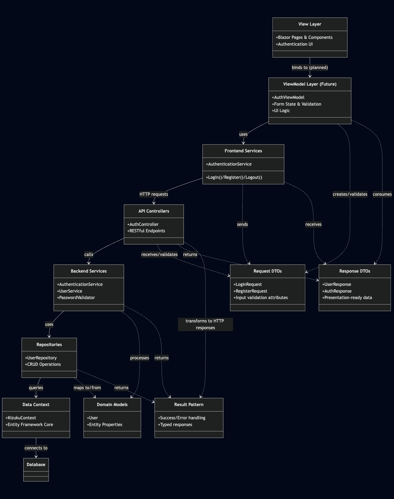
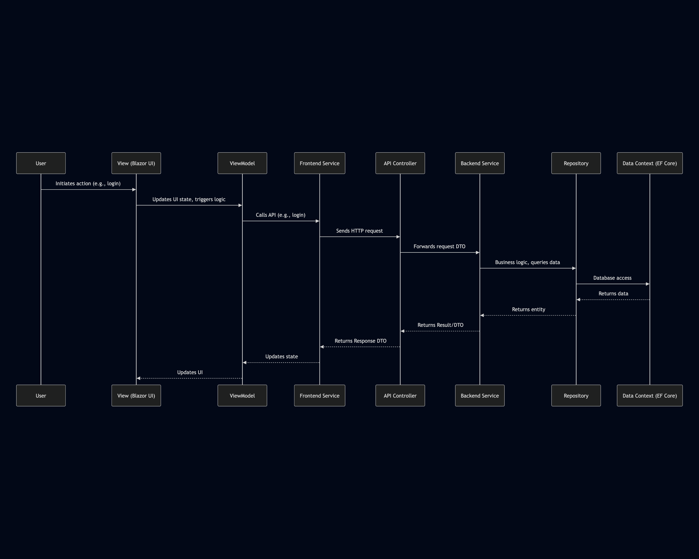

# Architecture Documentation

## Overview

Kizuku is built on a clean, layered architecture designed for maintainability and separation of concerns. 
The architecture follows modern best practices for Blazor applications, with a clear separation between frontend and backend components.

## Architecture Class Diagram



## Architecture Sequence Diagram



## Design Decisions

### Layered Architecture
Kizuku follows a layered architecture to ensure separation of concerns, making the codebase easier to maintain and test:

- **View Layer**: Contains all Blazor pages and components, responsible only for UI rendering and user interaction.
- **ViewModel Layer**: (Planned) Will handle UI state and logic, acting as a mediator between View and Services.
- **Frontend Services**: Handle communication with the backend API.
- **API Controllers**: Expose RESTful endpoints for frontend consumption.
- **Backend Services**: Implement business logic.
- **Repositories**: Encapsulate data access logic.
- **Data Context**: Defines the database schema and provides data access through Entity Framework Core.

### DTO Separation
We've explicitly separated DTOs into Request and Response types:

```csharp
// Instead of a single DTO like:
public class UserDTO { /* properties */ }

// We use separate models:
public class UserRequest { /* input properties */ }
public class UserResponse { /* output properties */ }
```

This separation provides several benefits:
- Clearer validation rules specific to inputs
- Prevention of over-posting vulnerabilities
- Independent evolution of input and output models
- More explicit API contracts

### Result Pattern
Kizuku uses a Result pattern for error handling instead of throwing exceptions:

```csharp
public async Task<Result<User>> GetUserById(string id)
{
    var user = await _repository.GetById(id);
    if (user == null)
        return Result<User>.Failure(new EntityNotFoundError($"User with id {id} not found."));
    
    return Result<User>.Success(user);
}
```

This approach provides:
- Explicit error handling
- Typed responses with success/failure status
- Consistent error propagation across layers
- Better testability

### Upcoming ViewModel Layer
The planned ViewModel layer will:
- Decouple UI logic from components
- Improve testability of UI behavior
- Handle form state and validation
- Manage component lifecycle events
- Transform data between View and Service layers

## Technology Stack

- **Frontend**: Blazor WebAssembly
- **Backend**: ASP.NET Core Web API
- **Database**: SQLite (Dev) with Entity Framework Core
- **Authentication**: ASP.NET Cookie Authentication

## Development Principles

- **Single Responsibility Principle**: Each class has one reason to change
- **Dependency Injection**: Used throughout to promote loose coupling
- **Repository Pattern**: For data access abstraction
- **Clean Architecture**: Ensuring dependencies point inward

This architecture supports our goals of creating a maintainable, testable, and scalable application while following modern best practices in .NET development.

